# 🚀 30-Day DSA Mastery Roadmap

### 🎯 **Mission**: Master Data Structures & Algorithms in 30 Days
**500 LeetCode Problems • 10 Projects • Full Stack Development**

---

## 📊 Progress Overview

### 🎯 Key Metrics

| Metric | Target | Status | Progress |
|--------|--------|--------|----------|
| **LeetCode Problems** | 500 | 👾 Inprogress |  |
| **Projects Built** | 10 | 👾 Inprogress |  |
| **Daily Study Hours** | 10h | 🔥 Consistent |  |
| **Languages Mastered** | Java + C++ | 👾 Inprogress |  |

---

## 📈 LeetCode Progress Tracking

### 📊 Daily Problem Distribution

| Day | Problems Solved | Cumulative | Easy | Medium | Hard |
|-----|----------------|------------|------|--------|------|
| 1-7 | 15-20 | 120 | 🟢 60% | 🟡 35% | 🔴 5% |
| 8-14 | 18-22 | 260 | 🟢 50% | 🟡 40% | 🔴 10% |
| 15-21 | 16-22 | 400 | 🟢 45% | 🟡 45% | 🔴 10% |
| 22-30 | 8-18 | 500 | 🟢 40% | 🟡 50% | 🔴 10% |

---

## 🛠️ Project Portfolio

### 📂 Project Timeline

### 🚀 Technologies Used

| Category | Count | Projects |
|----------|-------|----------|
| **JavaScript** | 4 | Todo App, Weather Dashboard, E-commerce Cart, Real-time Chat |
| **Python** | 2 | Data Analysis Dashboard, ML Price Predictor |
| **Java** | 1 | Banking System with GUI |
| **C++** | 1 | CLI Student Management System |
| **Web Development** | 2 | Portfolio Website, Full-stack Blog |

---

## ⏰ Daily Schedule & Time Management

### 📅 Optimized Daily Routine

| Time Slot | Activity | Duration | Focus Area |
|-----------|----------|----------|------------|
| 🌅 **6:00-8:00 AM** | DSA Theory | 2h | Concept Learning |
| 🎯 **8:00-10:00 AM** | LeetCode Practice | 2h | Problem Solving |
| 💻 **10:30-1:00 PM** | Project Development | 2.5h | Hands-on Coding |
| 🔥 **2:00-4:00 PM** | More LeetCode | 2h | Pattern Recognition |
| 🚀 **4:30-6:30 PM** | Project Work | 2h | Implementation |
| 📚 **7:30-9:00 PM** | Review & Planning | 1.5h | Consolidation |

---

## 🧠 DSA Topics Mastery

### 📚 Weekly Topic Breakdown

<strong>Week 1: Foundation (120 Problems)</strong>

- **Arrays & Two Pointers** 
  - Sliding Window, Prefix Sum
  - 
  
- **Strings & Pattern Matching**
  - KMP, Rabin-Karp algorithms
  - 
  
- **Hash Maps & Sets**
  - Frequency counting, Lookup optimizations
  - 

<strong>Week 2: Core Data Structures (140 Problems)</strong>

- **Linked Lists**
  - Reversal, Cycle detection, Merging
  - 
  
- **Stacks & Queues**
  - Monotonic stacks, BFS/DFS prep
  - 
  
- **Binary Trees**
  - Traversals, Height, Diameter
  - 

<strong>Week 3: Advanced Structures (140 Problems)</strong>

- **Advanced Trees**
  - BST operations, AVL concepts
  - 
  
- **Heaps & Priority Queues**
  - K-way merge, Top K problems
  - 

<strong>Week 4: Algorithms (100 Problems)</strong>

- **Sorting & Searching**
  - QuickSort, MergeSort, Binary Search
  - 
  
- **Dynamic Programming**
  - 1D/2D DP, Knapsack variations
  - 
  
- **Graph Algorithms**
  - BFS, DFS, Shortest paths
  - 

---

## 🎯 Success Strategies

```mermaid
flowchart TD
    A[🎯 Start Daily Routine] --> B{Morning Energy High?}
    B -->|Yes| C[🧠 DSA Theory 2h]
    B -->|No| D[☕ Quick Break]
    D --> C
    C --> E[💻 LeetCode Practice 2h]
    E --> F[🍽️ Lunch Break]
    F --> G[🚀 Project Development 2.5h]
    G --> H[🎯 More LeetCode 2h]
    H --> I[💼 Project Work 2h]
    I --> J[📚 Review & Plan 1.5h]
    J --> K[✅ Day Complete!]
    K --> L{Goals Met?}
    L -->|Yes| M[🎉 Celebrate Progress]
    L -->|No| N[📝 Adjust Tomorrow]
    M --> A
    N --> A
```

### 🔑 Key Success Principles

| Principle | Description | Implementation |
|-----------|-------------|----------------|
| **⚡ Consistency** | Small daily efforts compound | Never skip a day, even if just 30 min |
| **⏱️ Time Boxing** | Prevent overthinking single problems | Max 30 min per LeetCode problem |
| **🔄 Pattern Recognition** | Master templates, not memorization | Focus on understanding core patterns |
| **🎯 Progressive Overload** | Gradually increase difficulty | Start easy → medium → hard progression |
| **📊 Track Everything** | Data-driven improvement | Log daily progress and reflect weekly |

---

## 📈 Results & Achievements

### 🏆 **MISSION ACCOMPLISHED** 🏆

### 🎖️ Final Stats

- ✅ **500 LeetCode Problems** solved across all difficulty levels
- ✅ **10 Full-Stack Projects** built with multiple technologies  
- ✅ **300+ Hours** of focused study and coding
- ✅ **4 Programming Languages** mastered (Java, C++, JavaScript, Python)
- ✅ **Ready for Technical Interviews** at top tech companies

### 🚀 Skills Acquired

```mermaid
graph LR
    A[🎯 Problem Solving] --> B[💻 Algorithm Design]
    B --> C[🏗️ System Architecture] 
    C --> D[⚡ Code Optimization]
    D --> E[🧪 Testing & Debugging]
    E --> F[📊 Complexity Analysis]
    F --> G[🎤 Technical Communication]
```

---

## 📞 Connect With Me

---

### 🎯 "Consistency beats perfection. Progress beats perfection. Done beats perfect."

**⭐ Star this repo if it helped you on your DSA journey!**

